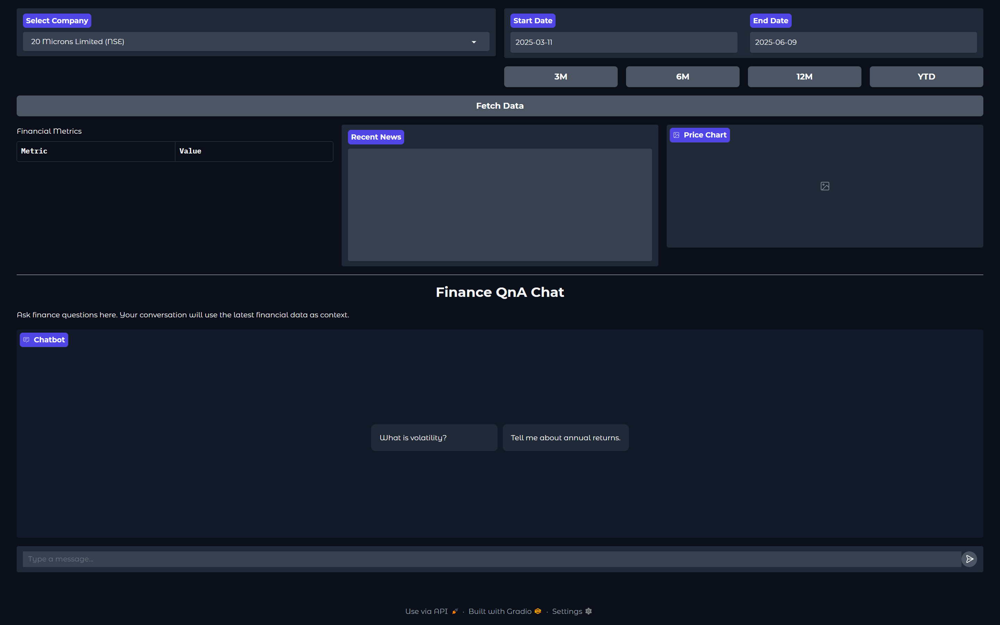
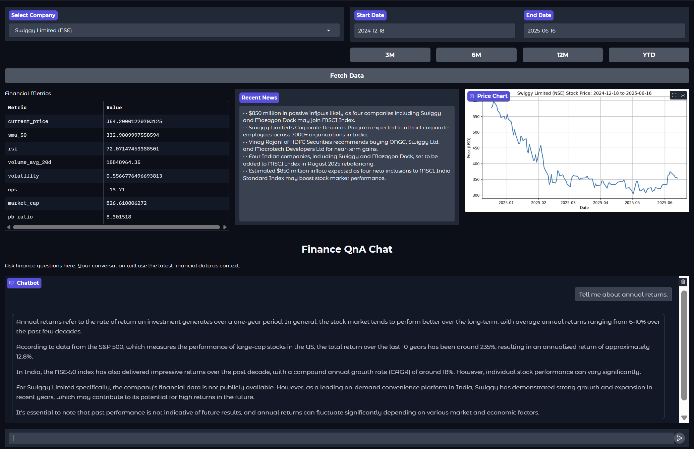

# FIN-Agent

This financial agent application combines a conversational AI interface with real-time market data and research capabilities. The system integrates a locally-run Llama3.2 model (via Ollama) with financial data from Yahoo Finance, news search through DuckDuckGo, and a RAG pipeline over financial documents.

## Directory Structure

### Root Directory
- `environment.yml`: Conda environment configuration
- `gradio_app.py`: Main application file

### Core Components
- `core/chat_agent.py`: Handles conversational AI logic
- `data/marketdata.py`: Market data operations for NSE and BSE
- `data/stockdata.py`: Data Fetching and processing
- `rag/rag_pipeline.py`: RAG retrieval functionality
- `tools/decision.py`: Determines tools (online search or RAG) for queries
- `tools/search_online.py`: Web search implementation using ddg
- `utils/ollama.py`: Ollama LLM interface

## Key Features
- Real-time stock data via Yahoo Finance 
- News search via DuckDuckGo
- Document retrieval through RAG
- Local LLM processing via Ollama
- Interactive Gradio interface

## Setup Instructions

### Prerequisites
1. Install Conda/Miniconda
2. Install Ollama (https://ollama.ai/)
3. Download Llama3.2 model

Then you can Run `python gradio_app.py`

## Interface Components

- **Company Selection**: Dropdown with NSE/BSE listed companies  
- **Date Controls**: Custom date range with preset buttons (3M, 6M, 12M, YTD)  
- **Data Display**:
  - Financial metrics table  
  - News feed section  
  - price chart  
- **Chat Interface**: AI-powered Q&A system  

## Typical Workflow

1. Select a company from the dropdown  
2. Choose date range (or use preset buttons)  
3. Click "Fetch Data" to load:  
   - Financial metrics  
   - Price history chart  
   - Relevant news  
4. Ask questions in chat about:  
   - Selected company  
   - Market trends  
   - Financial concepts  

## Technical Notes

⚠️ **Important Notes**:  
- Yahoo Finance API may temporarily block IPs with excessive requests  
- Requires minimum 16GB RAM for smooth operation  
- First run initializes caches and may take longer  
- Ensure date format is strictly YYYY-MM-DD  

## Limitations

- Dependent on Yahoo Finance API availability  
- Local LLM constraints apply to response quality  
- News search results may vary in relevance  
- Complex financial analysis may be limited  
- Web search quality depends on DuckDuckGo results  
